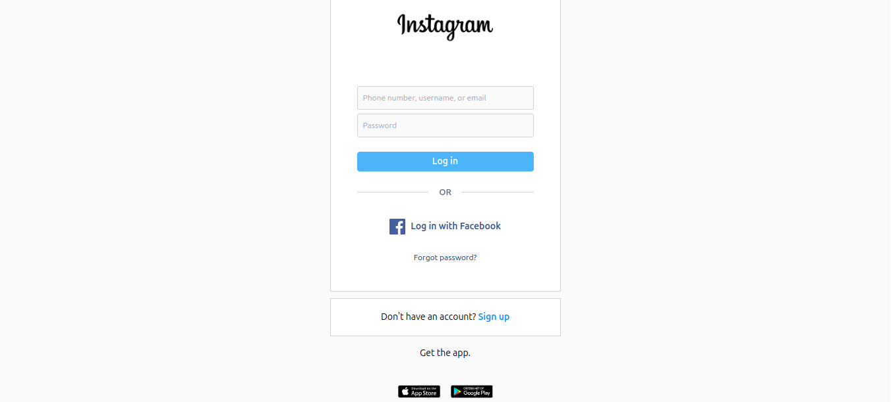

# 🔍 Instagram Clone Login Over HTTP - A Network Security Demonstration

This project demonstrates how insecure HTTP traffic can expose sensitive user data, such as login credentials, when intercepted using tools like Wireshark. It's a practical example for cybersecurity beginners exploring packet sniffing, insecure transmission, and browser-side protections.

## 🚧 What This Project Demonstrates
- How login forms behave over HTTP.
- How browsers today (like Chrome) actively protect users from insecure form submissions.
- Why HTTPS is essential for any site handling user input.
- How tools like Wireshark can be used to inspect network packets.

> **Educational Use Only:** This project is for learning purposes only and must not be used for unethical or malicious activities.

## 🧪 Tools Used
- Node.js (Express)
- Wireshark
- Ubuntu (for local testing)
- Browser (Chrome/Firefox)



👨‍💻 Author
Vilacegen
Cybersecurity Student | Developer | Curious Human

## ⚙️ How to Run the Project

```bash
git clone https://github.com/Vilacegen/Instagram-security.git
cd Instagram-security
npm install
node index.js


